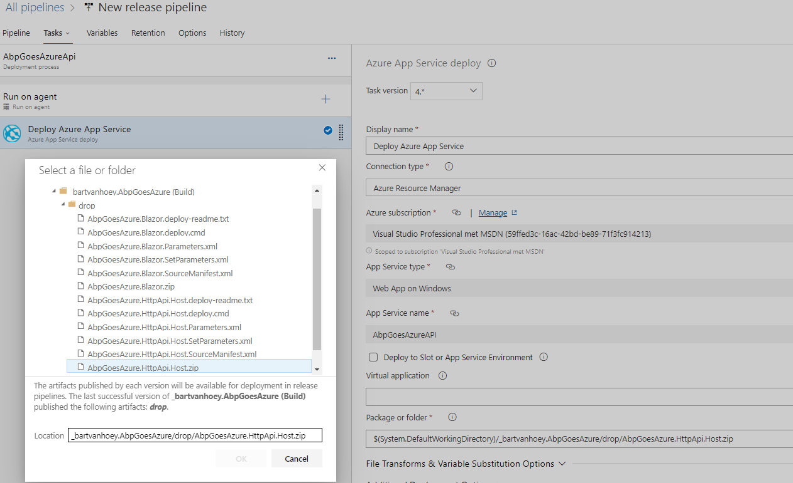
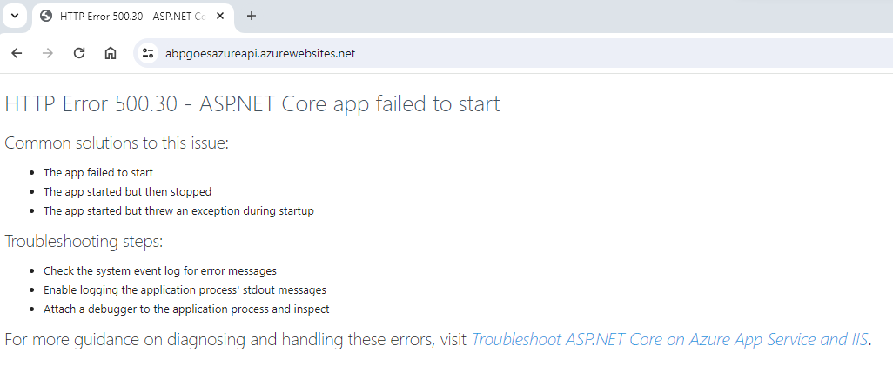

## Create Release pipeline and deploy HttpApi.Host project

* Open the [AzureDevops](https://dev.azure.com) page and click on the **Sign in to Azure Devops link**
--> This is no longer possible. Can you show how to setup the YML file for this process?* Click on [YourAppName]Proj and click on **Releases** in the **Pipelines** menu
* Click on the **New pipeline** button in the **No release pipelines found** window
* Select **Azure App Service deployment** and click the **Apply** button
* Enter **[YourAppName]Api** in the **Stage name** field in the **Stage** window. Close window
* Click **+ Add an artifact** in the **Pipeline** tab
* Select the **Build** icon as **Source type** in the **Add an artifact** window
* Select Build pipeline in the **Source (build pipeline)** dropdown and click the **Add** button at the bottom
* Click on the **Continuous deployment trigger (Circle with thunderbolt icon)**
* Set the toggle to **Enabled** in the the **Continuous deployment trigger** window
* Click **+ Add** in **No filters added**. Select **Include** in the **Type** dropdown.
* Select your branch in the **Build** branch dropdown and close the window
* Click on **the little red circle with the exclamation mark** in the **Tasks** tab menu
* Select your subscription in the **Azure subscription** dropdown
* Click **Authorize** and enter your credentials in the next screens
* After Authorization, select the **[YourAppName]Api** in the **App service name** dropdown
* Click on the **Run on agent** task.
* Select **Azure Pipelines** as Agent pool.
* Select **windows-lates** as Agent Specification.
* Click on the **Deploy Azure App Service** task
* Select **[YourAppName].HttpApi.Host.zip** in the **Package or folder** input field

  

* Click on the **Save** icon in the top menu and click **OK**
* Click **Create release** in the top menu. Click **Create** to create a release
* Click on the **Pipeline** tab and wait until the Deployment succeeds
* Navigate to the **URL** [https://[YourAppName]api.azurewebsites.net](https://[YourAppName]api.azurewebsites.net) of your Web App
* You probably see error **HTTP Error 500.30 - ASP.NET Core app failed to start**

[[Previous]](tutorial/../5.create-a-web-app-in-the-azure-portal-for-the-api-project.md) - [[Next]](tutorial/../7.deployment-succeeded-web-app-not-working-fix-the-issues.md)
